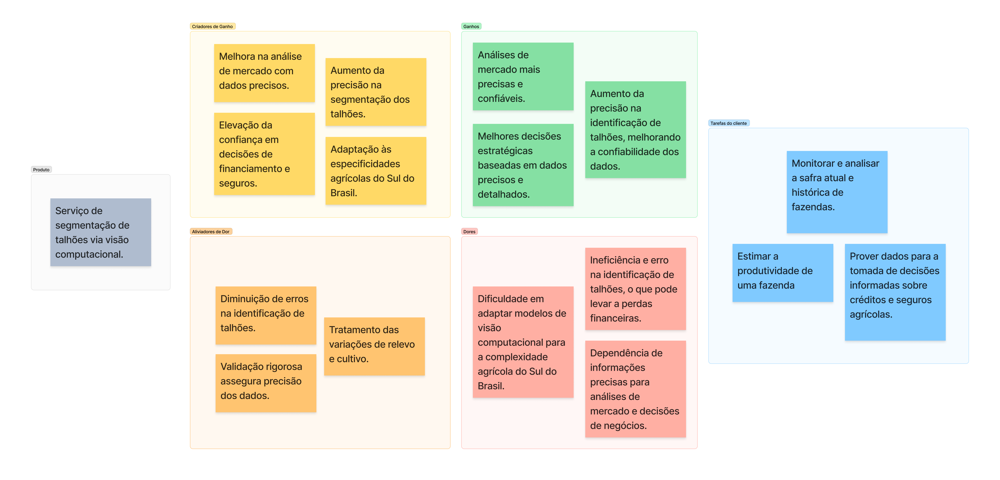

<table>
<tr>
<td>

</td>
<td>
</td>
</tr>
</table>

Segmentação de talhões por meio de visão computacional

- [1. Entendimento do Contexto do Problema](#1-entendimento-do-contexto-do-problema)
- [2. Entendimento da Experiência do Usuário](#2-entendimento-da-experiência-do-usuário)
- [3. Entendimento do Negócio](#3-entendimento-do-negócio)
  - [3.1. Canvas proposta de valor](#31-canvas-proposta-de-valor)
    - [3.1.1. Tarefas do Cliente](#311-tarefas-do-cliente)
    - [3.1.2. Dores](#312-dores)
    - [3.1.3. Aliviadores de Dor](#313-aliviadores-de-dor)
    - [3.1.4. Ganhos](#314-ganhos)
    - [3.1.5. Criadores de Ganho](#315-criadores-de-ganho)
    - [3.1.6. Produto](#316-produto)
- [4. Modelagem técnica do problema](#4-modelagem-técnica-do-problema)
  - [4.1 Introdução à Fonte de Dados](#41-introdução-à-fonte-de-dados)
    - [4.1.1 Descrição da Fonte](#411-descrição-da-fonte)
  - [4.2 Justificativa para Escolha da Base de Dados](#42-justificativa-para-escolha-da-base-de-dados)
    - [4.2.1 Referências Relevantes](#421-referências-relevantes)
    - [4.2.2 Relevância Local](#422-relevância-local)
    - [4.2.3 Parceria e Requisitos Técnicos](#423-parceria-e-requisitos-técnicos)
  - [4.3 Conclusão](#43-conclusão)
    - [4.3.1 Impacto do Uso da Base de Dados](#431-impacto-do-uso-da-base-de-dados)
- [5. Metodologia empregada](#5-metodologia-empregada)

# 1. Entendimento do Contexto do Problema

A agricultura de precisão está cada vez mais fundamentada na capacidade de analisar grandes volumes de dados e extrair insights significativos para a otimização da produção agrícola. Um componente crítico dessa análise é a segmentação de talhões, que permite uma avaliação detalhada da utilização da terra. Este processo é essencial para a implementação de estratégias de plantio, irrigação e colheita direcionadas. No cerne deste desafio está a necessidade de interpretar imagens de satélite com elevada fidelidade, uma tarefa que exige um modelo de visão computacional avançado capaz de produzir máscaras binárias precisas dos talhões agrícolas.

Para a empresa parceira, A de Agro, a precisão na segmentação de talhões não é apenas uma questão técnica, mas estratégica, pois a confiabilidade dos dados fornecidos sustenta toda a sua proposição de valor. Stakeholders como bancos e seguradoras dependem da precisão dessas informações para tomada de decisões relacionadas a créditos e seguros agrícolas. Portanto, a acurácia na identificação dos talhões produtivos está diretamente ligada à credibilidade e à eficácia das análises de mercado fornecidas, influenciando decisivamente a percepção de valor pelos clientes.

Este problema se faz complexo especialmente na Região Sul do Brasil, que apresenta uma complexidade agrícola singular, com variações de relevo e práticas de cultivo que desafiam a generalização dos modelos de visão computacional. Esta diversidade implica a necessidade de um modelo adaptativo, treinado e ajustado para interpretar a heterogeneidade das paisagens agrícolas sulistas. O modelo deve ser capaz de discernir nuances de textura, cor e padrões de plantio, que são críticos para a segmentação eficaz e são influenciados por fatores como a sazonalidade e as práticas agronômicas regionais.

O desenvolvimento do modelo de visão computacional para a segmentação de talhões é um exercício em aplicação de técnicas de machine learning avançadas, como redes neurais convolucionais (CNNs) e técnicas de aprendizado profundo. Estas técnicas são escolhidas por sua capacidade de capturar características espaciais complexas em imagens de alta resolução. O desafio reside em ajustar essas redes para lidar com a variabilidade intrínseca das imagens de satélite, que são afetadas por condições atmosféricas, variações de iluminação e diferenças sazonais.

A coleta de dados é fundamental para o sucesso do projeto. A A de Agro fornece um conjunto de dados inicial, mas a expansão desse conjunto é crucial para a generalização do modelo. A validação interna dos resultados segue uma metodologia rigorosa, utilizando métricas internas como a CovR para avaliar a precisão da segmentação. Esta abordagem de validação é projetada para assegurar que o modelo atenda aos padrões de precisão exigidos antes de ser implementado na plataforma de análise de safras.

Em conclusão, o projeto de segmentação de talhões da A de Agro é uma iniciativa ambiciosa que tem o potencial de transformar a análise de safras na Região Sul do Brasil. O modelo de visão computacional que está sendo desenvolvido é um passo fundamental para a realização da agricultura de precisão em escala. Além disso, as lições aprendidas e as metodologias desenvolvidas neste projeto têm o potencial de influenciar práticas futuras e inovações tecnológicas no campo da análise de dados agrícolas em escala global.

# 2. Entendimento da Experiência do Usuário

# 3. Entendimento do Negócio

## 3.1. Canvas proposta de valor

### 3.1.1. Tarefas do Cliente

- **Monitoramento de Safra**: Acompanhamento contínuo da safra atual e histórico de produção das fazendas para entender tendências e padrões.
- **Estimativas de Produtividade**: Utilização de dados precisos de segmentação de talhões para estimar a produtividade potencial das fazendas.
- **Tomada de Decisão Informada**: Fornecimento de informações detalhadas e confiáveis para decisões estratégicas relacionadas a créditos e seguros agrícolas.

### 3.1.2. Dores

- **Ineficiência na Identificação de Talhões**: Problemas frequentes na identificação correta dos talhões, levando a avaliações imprecisas e perdas financeiras.
- **Dependência de Dados Precisos**: A necessidade crítica de dados precisos e atualizados para análise de mercado e estratégias de negócios eficazes.
- **Complexidade Regional**: Desafios enfrentados na adaptação de modelos genéricos de visão computacional para a complexidade única do cenário agrícola do Sul do Brasil.

### 3.1.3. Aliviadores de Dor

- **Minimização de Erros de Identificação**: Implementação de técnicas avançadas de visão computacional para reduzir substancialmente os erros na identificação de talhões, mitigando riscos financeiros.
- **Processos de Validação Rigorosos**: Desenvolvimento de uma metodologia de validação interna que garante a precisão dos dados antes de sua utilização, proporcionando uma base sólida para análise.
- **Adaptação às Variações Agrícolas**: Personalização do modelo para tratar especificidades do terreno e práticas de cultivo do Sul do Brasil, resultando em dados mais representativos e aplicáveis.

### 3.1.4. Ganhos

- **Análises de Mercado Confiáveis**: Transformação dos dados de segmentação de talhões em insights valiosos para uma análise de mercado robusta e confiável.
- **Suporte a Decisões Estratégicas**: Fornecimento de informações detalhadas e precisas que suportam decisões estratégicas e otimização de investimentos.
- **Melhoria na Confiabilidade dos Dados**: Elevação da qualidade e confiabilidade dos dados fornecidos, reforçando a base para decisões críticas de negócios.

### 3.1.5. Criadores de Ganho

- **Análise de Mercado Avançada**: Fornecimento de dados granulares que permitem uma compreensão profunda do mercado, facilitando análises preditivas e estratégias de negócios mais eficientes.
- **Segmentação de Talhões de Alta Precisão**: Utilização de algoritmos de ponta para garantir uma segmentação extremamente precisa, melhorando a gestão de recursos e planejamento agrícola.
- **Decisões de Financiamento e Seguros Mais Confiáveis**: Aumento da confiabilidade dos dados para instituições financeiras e seguradoras, resultando em avaliações de risco mais precisas.
- **Customização para o Sul do Brasil**: Desenvolvimento de um modelo que não só entende mas também se adapta às nuances da agricultura sul-brasileira, oferecendo soluções específicas para os desafios locais.

### 3.1.6. Produto

- **Serviço de Segmentação de Talhões via Visão Computacional**: Um serviço especializado que aplica técnicas avançadas de machine learning e visão computacional para identificar e mapear talhões agrícolas com alta precisão. Este serviço é projetado para processar e analisar imagens de satélite, fornecendo aos clientes da A de Agro máscaras binárias detalhadas e informações sobre uso da terra que são essenciais para o gerenciamento eficiente de propriedades agrícolas.

Figura 1 - Canvas Proposta de Valor.

# 4. Modelagem técnica do problema

## 4.1 Introdução à Fonte de Dados

### 4.1.1 Descrição da Fonte

A base de dados consiste em imagens de alta resolução capturadas pelo satélite Sentinel-2, abrangendo regiões específicas do Paraná e Rio Grande do Sul. Estas áreas foram selecionadas devido à presença de talhões de plantio irregulares, que são o foco principal deste estudo.

## 4.2 Justificativa para Escolha da Base de Dados

### 4.2.1 Referências Relevantes

- O satélite Sentinel-2 é frequentemente destacado em publicações científicas pela sua capacidade de capturar imagens de alta resolução, essenciais para estudos agrícolas detalhados.
- Pesquisas recentes têm explorado a eficácia do Sentinel-2 para delineamento de campos agrícolas. Por exemplo, Zhang et al. (2021) desenvolveram um método automatizado usando uma U-net residual recorrente para a delimitação de campos a partir de imagens do Sentinel-2. Similarmente, Watkins e van Niekerk (2019) compararam várias abordagens de análise de imagem baseada em objetos para delinear limites de campos usando imagens multitemporais do Sentinel-2. Masoud et al. (2020) também destacam a utilização de redes convolucionais para esse fim.

### 4.2.2 Relevância Local

- As características específicas das imagens do Sentinel-2 são perfeitas para o mapeamento preciso das regiões selecionadas, que apresentam uma grande variabilidade nos talhões.
- As características únicas das imagens do Sentinel-2 são essenciais para o mapeamento preciso das regiões do Paraná e Rio Grande do Sul, onde os talhões apresentam formas irregulares e complexas. Isso desafia os algoritmos convencionais de segmentação, que frequentemente falham em áreas com essas características geométricas atípicas. O uso dessas imagens é crucial para adaptar e melhorar o algoritmo de nosso parceiro, que atualmente não atende adequadamente a essas áreas.
- A alta resolução e a frequência de atualização das imagens do Sentinel-2 oferecem uma oportunidade única para refinar e desenvolver métodos mais eficientes de segmentação e mapeamento.

### 4.2.3 Parceria e Requisitos Técnicos

- A escolha pela base de dados é reforçada pelo uso contínuo desta pelos nossos parceiros de projeto.
- As imagens são processadas em dimensões de 1200x1200 e segmentadas em menores áreas de 120x120, conforme recomendações acadêmicas para enriquecimento da base de dados.

## 4.3 Conclusão

### 4.3.1 Impacto do Uso da Base de Dados

A utilização dessas imagens é estratégica para o sucesso do projeto, permitindo uma análise detalhada e a aplicação de modelos de aprendizado de máquina avançados, aumentando significativamente a eficácia do monitoramento e gestão agrícola.

# 5. Metodologia empregada
