# Introdução

Nas últimas décadas, a agricultura tem se beneficiado significativamente do avanço da tecnologia, especialmente no âmbito da visão computacional. Esta disciplina emergente oferece um vasto potencial para transformar a maneira como entendemos e gerenciamos as operações agrícolas, particularmente na identificação e análise de áreas produtivas (DHANYA et al., 2022). O principal objetivo da visão computacional é fazer com que as máquinas vejam o mundo da mesma forma que os humanos. As principais tarefas incluem detecção, marcação, reconhecimento, classificação, segmentação, e análise de imagens, análise de vídeos, processamento de linguagem natural, entre outras (BHATT et al., 2021). Aplicações vão desde o setor agrícola até o setor de construção (PANERU e JEELANI, 2021), saúde (DONG e CATBAS, 2021) e análise de crimes (WILLIAM et al., 2023). No entanto, a segmentação de imagens de áreas de cultivo podem apresentar dificuldades devido ao ambiente complexo, às mudanças de estação e de iluminação (LUO et al., 2023).

Neste contexto, este artigo propõe uma investigação detalhada sobre a aplicação da visão computacional no setor agrícola, com foco na segmentação precisa de talhões produtivos dentro da Região Sul do Brasil por meio de redes neurais convolucionais (ALZUBAIDI, Laith et al., 2021). O desafio de identificar esses talhões não é apenas técnico, mas também estratégico para aprimorar a precisão das análises de safra, influenciando diretamente nas decisões dos produtores e stakeholders (WANG, Mo et al., 2022). Portanto, este estudo visa explorar não apenas os métodos e técnicas de visão computacional aplicadas ao processo de segmentação de imagens, mas também entender como essas ferramentas podem ser adaptadas às características específicas de relevo, clima e produção da região sulista do país. Ao almejar uma análise mais confiável e precisa dos talhões, este trabalho busca não apenas melhorar a eficiência operacional, mas também aumentar a credibilidade e confiança dos envolvidos na cadeia agrícola.

A seção "Trabalhos relacionados" discutirá trabalhos na literatura no campo da visão computacional aplicada à agricultura. A seção "Materiais e Métodos" irá trazer o processo de pré-processamento dos dados e a estrutura das redes convolucionais. A seção "Resultados" apresentará os resultados obtidos e a seção "Análise e Discussão" trará análises e discussões sobre esses resultados. Por fim, a seção "Conclusão" irá concluir o presente trabalho.

# Trabalhos Relacionados

Nesta seção, revisamos pesquisas recentes no campo da visão computacional aplicada à agricultura, com foco em metodologias para identificação e mapeamento de talhões agrícolas. As referências selecionadas não só são recentes, mas também amplamente citadas na literatura, assegurando a relevância e o impacto substancial destes trabalhos no campo de estudo. A  Tabela 1 resume estes trabalhos.

Tabela 1: Resumo dos trabalhos relacionados
| Estudo                       | Ano | Método Utilizado                     | Observação                                                  |
|------------------------------|-----|--------------------------------------|--------------------------------------------------------------|
| Zhang et al.                 | 2021| U-Net Residual Recorrente            | Delineação automática de limites de campos agrícolas na China usando imagens do Sentinel-2 |
| Papadopoulou et al.          | 2023| CNN Temporal e Combinada (R-CNN)     | Comparação de modelos de aprendizado profundo para mapeamento de cobertura e tipos de cultivos agrícolas usando imagens multitemporais do Sentinel-2 |
| Singh et al.                 | 2022| U-Net                                | Mapeamento de uso de terra de culturas de inverno na Índia usando modelos de aprendizagem profunda |
| Debella-Gilo e Gjertsen      | 2021| CNN em séries temporais              | Mapeamento de tipos de uso de terra agrícola na Noruega utilizando séries temporais do Sentinel-2 |
| Khan et al.                  | 2023| LSTM                                 | Identificação precoce de tipos de culturas em pequenos sistemas agrícolas usando imagens temporais do Sentinel-2 |
| Waldner e Diakogiannis       | 2020| Redes Neurais Convolucionais         | Extração de limites de campos agrícolas com alta precisão usando imagens de satélite |
| JONG, Maxwell et al. | 2022 | ResUNet | Previsão de limites de campos agrícolas em imagens de satélite, utlizando Redes Generativas Adversariais |
| OLIVEIRA et al. | 2022 | U-Net | Segmentação semântica de áreas de plantações agrícolas via U-Net em dois estágios |
| Rukhovich et. al.            | 2021| Redes Neurais Convolucionais | Identificação de possíveis áreas de degradação no solo usando aprendizado de máquina profundo. |
| Ouhami, Maryam, et al. | 2021 | Support vector machine (SVM) | Utilização de visão computacional para o controle e detecção de doenças em plantas |
| REDMON, J. et al. | 2016 |  You Only Look Once (YOLO) | Método de detecção de objetos em tempo real como um problema de regressão de bounding boxes e classe|
| HE, K. et al, | 2016 | ResNet | Permitem o treinamento de redes mais profundas |
| L. Perez, J. WANG, J. et al | 2017 | The Effectiveness of Data Augmentation in Image Classification using Deep Learning | Demonstra como o data augmentation melhora a performance dos modelos de classificação de imagens |

# Materiais e Métodos
Nesta seção será discutido como foi feito o pré-processamento dos dados visando prepará-los adequadamente para uso no treinamento e teste do modelo. Além dos modelos próprios implementados e a técnica de transfer learning.

## Pré-processamento
Devido a escassez de dados e o processo longo e manual de rotulação e criação das máscaras foi utilizado um modelo matemático próprio, criado utilizando Blender e geometry nodes, que cria  um limite indefinido de imagens realistas de talhões e suas respectivas máscaras. Por ser uma primeira versão, ainda há uma diferença vísivel entre essas imagens e imagens reais de satélite, mas os resultados obtidos nessa pesquisa será utilizado para melhorias e implementações contínuas neste modelo.

Técnicas de data augmentation (ZHANG et al, 2021) (MAHARANA et al., 2022) foram empregadas para aumentar o dataset e melhorar a performance do modelo. Cada imagem passa por trˆes processamentos. Primeiramente, ela  ́e rotacionada 90º (pseudocódigo da figura 1). Depois, o brilho da imagem  ́e aumentado em 1.2 vezes (pseudocódigo da figura 2). Por fim, a saturação ́e dobrada (pseudocódigo da figura 3). Além de gerar mais dados, também geramos imagens que podem representar condições de imagens reais, como iluminação, tornando o modelo mais generalizável. Por fim, cada imagem é dividida em subimagens de 200px x 200px (pseudocódigo da figura 4). Com o objetivo de maximizar o número de subimagens foi decidido dividir na ordem da imagem original e não em quadrados aleatórios. As figuras 5 e 6 ilustram os resultados destas etapas para uma imagem. 

```
Definir função apply_transformation com parâmetros:
    image: imagem a ser transformada
    mask: máscara a ser transformada
    transformation: função de transformação a ser aplicada
    img_path: caminho para salvar a imagem transformada
    mask_path: caminho para salvar a máscara transformada
    image_name: nome da imagem
        Aplicar a transformação na imagem:
    Chamar transformation(image) e salvar no caminho img_path com o nome image_name_1.png
        
        Aplicar a transformação na máscara:
    Chamar transformation(mask) e salvar no caminho mask_path com o nome image_name_1.png
    Retornar o resultado das duas operações de salvamento

Definir função rotation com parâmetros:
    image: caminho da imagem a ser rotacionada
    mask: caminho da máscara a ser rotacionada
    angle: ângulo de rotação
    img_path: caminho para salvar a imagem rotacionada
    mask_path: caminho para salvar a máscara rotacionada
    image_name: nome da imagem
        Abrir a imagem usando Image.open(image)
        Abrir a máscara usando Image.open(mask)
        Chamar apply_transformation com os seguintes argumentos:
    imagem aberta
    máscara aberta
    lambda function para rotacionar a imagem com o ângulo especificado e expandir a borda conforme necessário
    img_path
    mask_path
    image_name
    Retornar o resultado da chamada de apply_transformation
```
Figura 1: Pseudocódigo para rotação de imagens

```
Definir função adjust_brightness com parâmetros:
    img: caminho da imagem a ser ajustada
    mask: caminho da máscara a ser mantida
    img_path: caminho para salvar a imagem ajustada
    mask_path: caminho para salvar a máscara mantida
    image_name: nome da imagem
    factor: fator de ajuste de brilho, padrão é 1.5
        Abrir a imagem usando Image.open(img)
        Abrir a máscara usando Image.open(mask)
        Criar um objeto enhancer_img usando ImageEnhance.Brightness e passando a imagem aberta (img_to_adjust)
        Ajustar o brilho da imagem chamando enhancer_img.enhance(factor)
        Salvar a imagem ajustada no caminho img_path com o nome image_name_2.png
        Salvar a máscara no caminho mask_path com o nome image_name_2.png
        Retornar o resultado das duas operações de salvamento
```
Figura 2: Pseudocódigo para aumento de brilho de imagens

```
Definir função increase_saturation com parâmetros:
    input_path: caminho da imagem de entrada
    input_masks_path: caminho da máscara de entrada
    output_path: caminho para salvar a imagem ajustada
    output_mask_path: caminho para salvar a máscara mantida
    image_name: nome da imagem
    factor: fator de aumento de saturação, padrão é 2
        Abrir a imagem usando Image.open(input_path)
        Abrir a máscara usando Image.open(input_masks_path)
        Aumentar a saturação da imagem:
    Criar um objeto enhancer usando ImageEnhance.Color com a imagem aberta
    Aplicar o aumento de saturação chamando enhancer.enhance(factor)
        Salvar a imagem com saturação aumentada no caminho output_path com o nome image_name_saturation.png
        Salvar a máscara no caminho output_mask_path com o nome image_name_saturation.png
        Retornar a imagem com saturação aumentada
```
Figura 3: Pseudocódigo para saturação de imagens

```
Definir função crop_image com parâmetros:
    img_path: caminho da imagem a ser recortada
    path_to_subimages: caminho para salvar as subimagens recortadas
        Extrair o nome da imagem do caminho img_path:
    Separar o caminho pelo caractere "/" e pegar o último elemento
    Separar o último elemento pelo caractere "." e pegar o primeiro elemento como image_name
        Abrir a imagem usando Image.open(img_path) (img_to_crop)
        Definir o tamanho das subimagens (subimage_size) como 200 pixels
        Calcular o número máximo de subimagens em cada dimensão:
    x_subimages = largura da imagem // subimage_size
    y_subimages = altura da imagem // subimage_size
        Definir função interna save_subimage com parâmetros:
    img: subimagem a ser salva
    i: índice da subimagem na dimensão x
    j: índice da subimagem na dimensão y
    Salvar a subimagem no caminho path_to_subimages com o nome image_name_i_j.png
        Iterar sobre a imagem para salvar cada subimagem:
            Para i de 0 até x_subimages - 1:
                Para j de 0 até y_subimages - 1:
                    Definir as coordenadas da subimagem:
    left = i * subimage_size
    upper = j * subimage_size
    right = left + subimage_size
    lower = upper + subimage_size
                    Recortar a subimagem usando img_to_crop.crop((left, upper, right, lower))
                    Chamar save_subimage(subimage, i, j)
```
Figura 4: Pseudocódigo para recorte de imagens

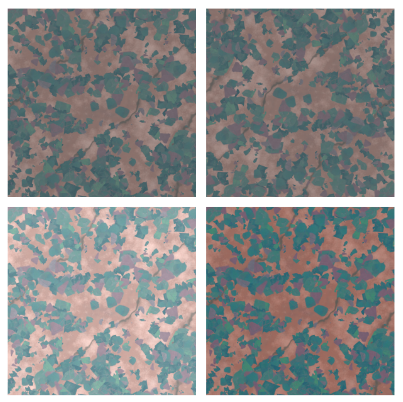


Figura 5: Técnicas de Data Augmentation da imagem. Imagem original / Imagem rotacionada / Imagem com mudança de brilho / Imagem saturada

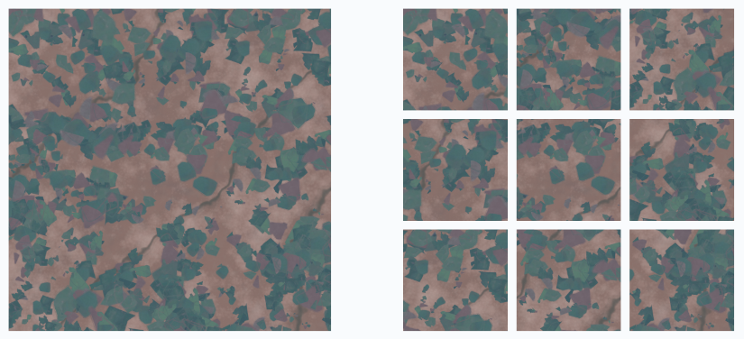
Figura 6: Divisão da imagem em subimagens de 200px x 200px

Por fim, as imagens são normalizadas para uma escala de 0 a 1 apenas dividindo os valores RGB de cada pixel por 255 para diminuir o tempo de processamento do modelo. 200 imagens iniciais foram dividas em dados de treino e validação (120 e 80 respectivamente). As imagens de treino geraram 360 imagens com data augmentation. Cada imagem, tanto de treino como de validação gerou 9 subimagens (600 divido por 200). Assim, temos 560 imagens gerando 5040 imagens para o dataset final (4320 para treino e 720 para teste). Essas 5040 imagens são salvas em um dataframe e posteriormente são redimensionadas para 208 x 208px, dimensão aceita pelo modelo. A figura 7 ilustra as etapas do pré-processamento.

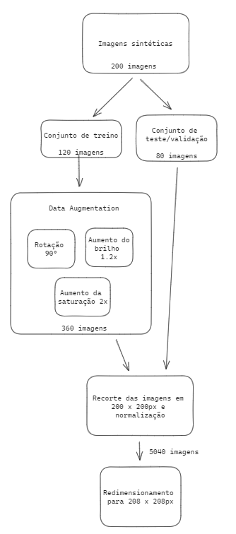

Figura 7: Etapas do pré-processamento

## Considerações para deploy
Apesar de não ter sido feito um deploy da solução, o código foi desenvolvido pensando em prepará-lo para um possível deploy. Os pontos considerados estão resumidos na tabela 1. Todos esses pontos foram levados em consideração para garantir que a aplicação seja de fácil entendimento, reproduzível e adaptável da melhor maneira possível, podendo ser usada para diferentes casos de uso.

Tabela 2:  Práticas de Desenvolvimento de Software
|Etapa | Importância | Aplicação |
|-----| ------| ------ |
| 1. Encapsulamento | Assegura que a aplicação e todas as suas dependências sejam isoladas, portáveis, seguras e fáceis de gerenciar. Também promove consistência e facilita a automação. | Cada função ou classe é responsável por uma funcionalidade específica. O que acontece em cada uma não impacta o restante do código. |
| 2. Qualidade do código| É avaliada por sua legibilidade, manutenibilidade, eficiência, confiabilidade, segurança, adesão a padrões e boas práticas, e simplicidade. A adoção de boas práticas de codificação facilita a manutenção e entendimento do código.| Indentação consistente, nome de variáveis e funções significativas e documentação no formato docstring garantem a legibilidade do código. |
|3. Reutilização de código e de funções | Promove eficiência e manutenção, evitando duplicação e facilitando atualizações no desenvolvimento de software. | Tudo que é utilizado mais de uma vez foi modularizado para facilitar a reutilização e o uso de parâmetros garante uma dinamicidade ao uso, podendo ser facilmente adaptado onde for necessário. |
| 4. Documentação completa  | Garante que todos os aspectos do sistema sejam compreensíveis e acessíveis, facilitando o uso, manutenção e evolução do software. | Documentação detalhada de parâmetros, funcionalidades e retornos de cada método e classe para facilitar o entendimento. |
| 5. Modularidade | Divide um sistema em partes independentes e específicas, facilitando a manutenção, reutilização, escalabilidade, flexibilidade, compreensibilidade, colaboração e testabilidade do sistema. | Cada funcionalidade do sistema foi modularizada em métodos próprios. |
| 6. Gerenciamento de dependências | Garantir que a mesma versão de bibliotecas externas sejam usadas por todos para que não haja problemas na aplicação. | Foi criado um arquivo "requirements.txt" com a lista de todas as dependências necessárias e suas respectivas versões. |
| 7. Manuseio de erros. | Garantir que a aplicação possa lidar com falhas de maneira controlada e previsível. Boas práticas no manuseio de erros aumentam a robustez, a usabilidade e a manutenção do software. | Para cada método foi adicionado uma mensagem de erro amigável utilizando blocos `try-catch`. |

## Arquitetura do modelo convolucional implementado

RONNEBERGER et al. (2015) introduz a arquitetura U-Net, uma rede neural convolucional (CNN) projetada especificamente para a segmentação de imagens biomédicas. A U-Net é notável por sua estrutura simétrica que combina uma via de contração para capturar contexto e uma via de expansão para permitir uma localização precisa. A figura 4 ilustra essa estrutura que consiste em um caminho de codificação que reduz as dimensões das imagens de entrada e um caminho de decodificação que restaura suas dimensões originais. Cada caixa representa um mapa de características, com caixas tracejadas indicando mapas de características copiados do caminho de codificação. As setas representam operações como convoluções e pooling. A U-net em cada passo de contração duplica o número de filtros e na expansão divide pela metade. Tanto a figura 8 e a Tabela 3 representam a estrutura da rede deste trabalho, com cada camada, suas dimensões e detalhes importantes. Foi adicionada ao treinamento a técnica de "early stopping" para evitar overfitting, ou seja, parar o treinamento caso alguma métrica, normalmente o erro ou a acurácia da validação, pare de apresentar melhorias.

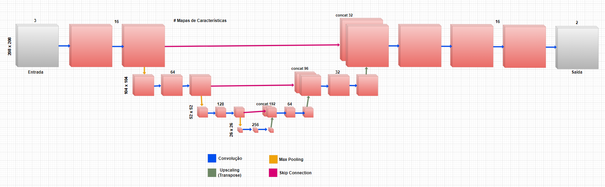

Figura 8: Arquitetura U-net implementada

Outra técnica utilizada para evitar o overffiting foi a adição de dropout, uma técnica que desliga neurônios aleatórios inibindo qualquer dependência entre camadas. Ao fazer uma análise, vimos que o resultado ótimo se encontra em torno de 10%, visto que obtivemos um loss de 0,27 como pode ser visto na figura 9.

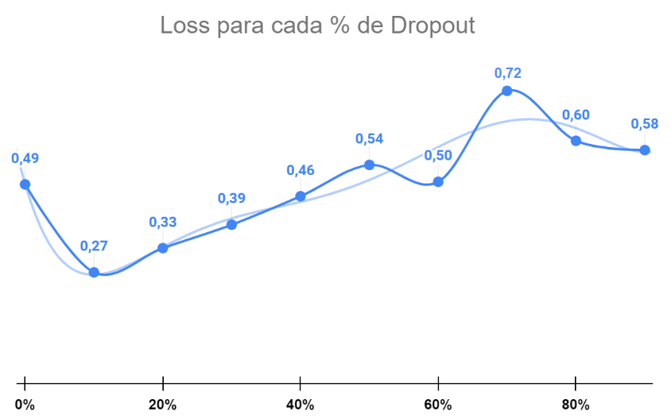
Figura 9: Gráfico da quantidade média de Loss por % de Dropout

Tabela 3: Arquitetura U-NET especifica desenvolvida para este trabalho
| Camada                       | Output Shape | Número de Filtros                      | Dimensão do filtro / pooling | Observações |
|------------------------------|-----|-----|--------------------------------------|--------------------------------------------------------------|
**CODIFICADOR**
Input Layer | 208 x 208 x 3 | - | - | -
Conv1 | 208 x 208 x 16 | 16 | 3x3 | padding + ativação ReLU
Conv2 | 208 x 208 x 16 | 16 | 3x3 | padding + ativação ReLU
Batch Normalization | 208 x 208 x 16 | - | Após, camada de Dropout de 10%
Max Pooling 2x2 | 104 x 104 x 16 | - | 2x2
Conv3 | 104 x 104 x 64 | 64 | 3x3 | padding + ativação ReLU
Conv4 | 104 x 104 x 64 | 64 | 3x3 | padding + ativação ReLU
Batch Normalization | 104 x 104 x 64  | - | Após, camada de Dropout de 10%
Max Pooling 2x2 | 52 x 52 x 64 | - | 2x2
Conv5 | 52 x 52 x x 128 | 128 | 3x3 | padding + ativação ReLU
Conv6 | 52 x 52 x x 128 | 128 | 3x3 | padding + ativação ReLU
Batch Normalization | 52 x 52 x x 128  | - | Após, camada de Dropout de 10%
Max Pooling 2x2 | 26 x 26 x 128 | - | 2x2
Conv7 | 26 x 26 x 256 | 256 | 3x3 | padding + ativação ReLU
Conv8 | 26 x 26 x 256 | 256  | 3x3 | padding + ativação ReLU
Batch Normalization |  26 x 26 x 256  | - | Após, camada de Dropout de 10%
|------||------||------
**DECODIFICADOR**
ConvTranspose1 | 52 x 52 x 64 | 64 | 3x3 | stride 2 + padding
Concatenate1 (ConvTranspose1 + Conv8)| 52 x 52 x 192 | - | -
Conv9 | 52 x 52 x 64 | 64 | 3x3 | padding + ativação ReLU + Após, camada de Dropout de 10%
Conv10 | 52 x 52 x 64 | 64 | 3x3 | padding + ativação ReLU
ConvTranspose2 | 104 x 104 x 32 | 32 | 3x3 | stride 2 + padding
Concatenate2 (ConvTranspose2 + Conv6)| 104 x 104 x 96 | - | -
Conv11 | 104 x 104 x 32 | 32 | 3x3 | padding + ativação ReLU + Após, camada de Dropout de 10%
Conv12 | 104 x 104 x 32 | 32 | 3x3 | padding + ativação ReLU
ConvTranspose3 | 208 x 208 x 16 | 16 | 3x3 | stride 2 + padding
Concatenate3 (ConvTranspose2 + Conv4)| 208 x 208 x 32 | - | -
Conv15 | 208 x 208 x 16 | 16 | 3x3 | padding + ativação ReLU + Após, camada de Dropout de 10%
Conv16 | 208 x 208 x 16 | 16 | 3x3 | padding + ativação ReLU
|------||------||------
Conv17 | 208 x 208 x 16 | 16 | 3x3 | padding + ativação ReLU
Conv18 | 208 x 208 x 2 | 2 | 1x1 | padding

### Predição de bordas
Para fazer com que o modelo segmente de uma forma mais eficaz as bordas dos talhões foi aplicado um método de predição de bordas. Primeiramente, utilizando as máscaras de segmentação originais novas máscaras são criadas utilizando a biblioteca 'OpenCV' do python e sua função 'canny', um algoritmo de detecção de bordas (vide figura 10). O algoritmo Canny funciona através de várias etapas. Primeiramente, utiliza um filtro Gaussiano para suavizar a imagem e remover detalhes indesejados. Em seguida, determina a direção do gradiente e a magnitude do gradiente dos pixels. Cada pixel é marcado como uma borda somente se a magnitude do seu gradiente for maior que a de seus dois vizinhos na direção do gradiente. Após isso, usa uma técnica para eliminar bordas fracas e, por fim, aplica a limiarização para gerar as bordas detectadas na imagem (LYNN et al, 2021). Após isso, um modelo com a mesma estrutura descrita anteriormente é treinado utilizando essas máscaras como alvo, gerando um modelo de predição de bordas. Dessa forma, treinamos um outro modelo para a segmentação com as informações de borda geradas como um quarto canal. Na inferência, a imagem passa pela predição de bordas, o resultado é adicionado como um quarto canal e essa nova imagem é passada para o modelo de segmentação.

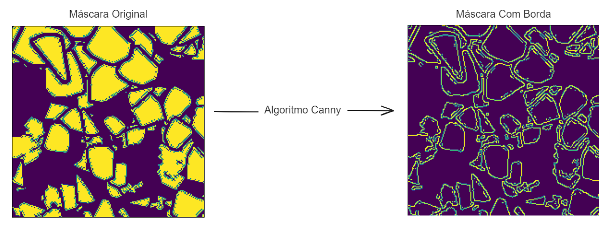
Figura 10: Resultado do algoritmo canny

```
1. Definir a função highlight_edges_on_image(real_mask):
   1.1. Remove dimensões de tamanho 1 da máscara real.
   1.2. Se a máscara real não for do tipo uint8:
       1.2.1. Normaliza a máscara real para 8 bits (0-255).
   1.3. Detecta as bordas na máscara real usando o algoritmo Canny.
   1.4. Retorna a imagem de bordas normalizada.

2. Criar arrays de zeros para as máscaras de bordas de treino e teste com as mesmas dimensões das máscaras originais.

3. Para cada máscara na base de treino:
   3.1. Obter a máscara real.
   3.2. Destacar as bordas da máscara real usando highlight_edges_on_image.
   3.3. Redimensionar a imagem destacada para o formato original da máscara.
   3.4. Armazenar a imagem destacada no array de treino de bordas.

4. Para cada máscara na base de teste:
   4.1. Obter a máscara real.
   4.2. Destacar as bordas da máscara real usando highlight_edges_on_image.
   4.3. Redimensionar a imagem destacada para o formato original da máscara.
   4.4. Armazenar a imagem destacada no array de teste de bordas.
```
Figura 11: Pseudocódigo para criação das bordas

## Modelo CNN pré-treinado

### Transfer Learning

O aprendizado por transferência (Transfer Learning) se tornou uma ferramenta essencial no campo da inteligência artificial, especialmente no contexto de redes neurais artificiais. Essa abordagem inovadora se baseia na reutilização de conhecimento adquirido em uma tarefa para otimizar o desempenho em outra tarefa relacionada. Um dos trabalhos pioneiros na área de transfer learning em redes neurais é o artigo seminal "Using Knowledge in Neural Networks" de Hatzisavvas e Reggia (1997). Os autores propõem uma estrutura formal para a transferência de conhecimento entre redes neurais, definindo diferentes tipos de cenários de transferência e demonstrando a efetividade da abordagem em tarefas de diagnóstico médico. No entanto, foi no campo da visão computacional que o transfer learning realmente se consolidou como um método revolucionário. A utilização de redes neurais pré-treinadas em grandes conjuntos de dados, como o ImageNet, como ponto de partida para o treinamento em tarefas específicas de visão computacional impulsionou significativamente o estado da arte na área.

Um exemplo notável do impacto do transfer learning na visão computacional é o artigo "ImageNet Classification with Deep Convolutional Neural Networks" de Krizhevsky et al. (2012). Nesse trabalho, os autores apresentaram a arquitetura AlexNet, vencedora do desafio ImageNet 2012 com grande margem de performance. A AlexNet se baseou no uso de transfer learning, pré-treinando a rede em um conjunto de dados massivo de imagens não relacionadas (ImageNet) e ajustando-a posteriormente para a tarefa de classificação de imagens do ImageNet. O sucesso da AlexNet popularizou o uso de transfer learning em CNNs e inspirou o desenvolvimento de diversas arquiteturas inovadoras que impulsionaram o progresso na visão computacional.Atualmente, o transfer learning é um componente crucial para o desenvolvimento de modelos de última geração em diversas tarefas de visão computacional, como reconhecimento de imagens, classificação de objetos, segmentação de imagens, detecção de objetos e análise de imagens médicas. A reutilização de conhecimento pré-treinado permite que os modelos aprendam com conjuntos de dados menores de forma mais eficiente e eficaz, alcançando resultados de alta performance em tarefas complexas.

Em resumo, o transfer learning se tornou um método fundamental para o aprendizado em redes neurais, especialmente na área da visão computacional. Essa abordagem inovadora oferece diversas vantagens, como a redução do tempo e esforço necessários para treinar modelos complexos, a otimização do uso de dados de treinamento e o aprimoramento do desempenho geral dos modelos. O transfer learning continuará a ser um motor essencial para o progresso na visão computacional, impulsionando o desenvolvimento de modelos cada vez mais precisos, robustos e eficientes.

### Modelos pré-treinados

O paper "Automatic Delineation of Agricultural Fields from Sentinel-2 Images", publicado em 2021 por alunos da Universidade de Twente (Holanda) descreve uma metodologia promissora para servir como base de transfer learning em trabalhos futuros que visem a identificação automática de talhões agrícolas por meio de imagens de satélite. O estudo propõe o treinamento de uma Rede Neural Convolucional Totalmente Convolucional (FCN) para extrair delimitações de campos agrícolas a partir de imagens de satélite Sentinel-2. Um dos pontos fortes do trabalho é a utilização de dados abertos e gratuitos, tornando a solução acessível para uma ampla comunidade de pesquisadores. Além disso, o uso de bibliotecas Python como TensorFlow e Keras facilita a replicação e adaptação do modelo para diferentes regiões e tipos de culturas. O trabalho descrito neste artigo fornece uma base sólida para o uso de transfer learning em um projeto de identificação de talhões em áreas rurais. A utilização de redes neurais convolucionais totalmente convolucionais (FCN) para extrair as fronteiras de campos agrícolas com base em imagens de satélite demonstra a eficácia dessa abordagem. A metodologia detalhada no artigo, juntamente com a avaliação de diferentes implementações de redes neurais convolucionais, oferece um ponto de partida robusto para a aplicação de transfer learning.

A transferência de conhecimento adquirido com o treinamento do modelo FCN em imagens de satélite para a tarefa específica de identificação de talhões em áreas rurais permite aproveitar os padrões visuais aprendidos durante o treinamento inicial. Isso é especialmente relevante considerando a variabilidade das características visuais de diferentes regiões agrícolas. Ao utilizar o modelo base descrito no artigo, há a economia de tempo e recursos, aproveitando o conhecimento prévio do modelo para acelerar o treinamento e melhorar a precisão da identificação de talhões em novos conjuntos de dados de imagens de satélite. Além disso, o artigo destaca a possibilidade de aprimorar o modelo por meio de investigações adicionais, como a inclusão de imagens de diferentes regiões agrícolas e o ajuste do modelo FCN para melhor se adequar à tarefa de identificação de talhões. Isso demonstra que o trabalho fornece não apenas um ponto de partida, mas também um caminho claro para a otimização do modelo por meio de transfer learning.

Em resumo, o transfer learning se tornou um método fundamental para o aprendizado em redes neurais, especialmente na área da visão computacional. Essa abordagem inovadora oferece diversas vantagens, como a redução do tempo e esforço necessários para treinar modelos complexos, a otimização do uso de dados de treinamento e o aprimoramento do desempenho geral dos modelos. O transfer learning continuará a ser um motor essencial para o progresso na visão computacional, impulsionando o desenvolvimento de modelos cada vez mais precisos, robustos e eficientes.

O processo de transfer learning foi feito com uma Arquitetura U-Net, extraída do projeto descrito acima. Para que fosse possível executar a rede com os dados deste trablaho, foi preciso adcionar um Dropout de 30\%, duas camadas de convolução e uma camada de Up Sampling. O treinamento foi feito em 50 épocas, como função de perda foi utilizada a Sparse Categorical Cross entropy e como métrica de avaliação foi utlizada a acurácia, Iou e CovR.

## Escolhas de métricas para avaliação

Ao desenvolver o modelo, utilizamos como métrica de avaliação de desempenho a acurácia, IoU (Intersection over Union) e o Coverage Ratio. 

### Acurácia 
Diferente da precisão, a ideia da acurácia se baseia em analisar os pontos em que o modelo acerta, levando em consideração os pontos em que o modelo erra também, dessa forma podemos calcular a acurácia por meio da seguinte fórmula

$Acuracia = \frac{VP + VN}{VP + FP + VN + FN}$

Em que:
- VP representa os valores "Verdadeiro positivo", portanto os valores classificados como talhão e que realmente eram
- VN representa os valores "Verdadeiro negativo", portanto os valores que não são talhão e que o modelo classificou como não pertencente à classe talhão
- FP representa os valores "Falso positivo", portanto os valores que o modelo classificou como talhão, mas na verdade não eram
- FN representa os valores "Falso negativo", portanto os valores que foram classificados como não pertencentes à classe talhão, porém na realidade pertencem

Para sabermos esses valores é comum utilizarmos uma "Matriz de confusão", uma matriz 2x2 que apresenta esses exatos 4 valores descritos anteriormente

Como estamos lidando com um modelo de segmentação, a classificação é feita para cada píxel da imagem, comparando o pixel da imagem retornada pelo modelo com o pixel na mesma posição da máscara que já temos no dataset. Ao fim de todos os pixels conseguimos determinar a acurácia do modelo na segmentação daquela imagem específica.

### IoU
Para problemas de segmentação talvez essa seja a métrica mais simples para avaliarmos a qualidade de uma segmentação. Essa métrica mede a sobreposição entre a máscara prevista pelo modelo e a máscara real da imagem.

$Iou = \frac{AI}{AU}$

Em que:
- AI representa a Área de Intersecção
- AU representa a Área de União

### Coverage Ratio
O Coverage Ratio (CovR) é uma métrica criada para resolver limitações do Índice de União sobre Interseção (IoU), especialmente em casos como a segmentação de talhões agrícolas, onde as bordas são cruciais. Diferente do IoU, que foca apenas na área de intersecção entre as máscaras real e predita, o CovR considera a pureza dos talhões segmentados, evitando a mistura de diferentes tipos de talhões e minimizando ruídos. O CovR avalia se os talhões segmentados contêm uma boa proporção dos pixels do talhão real sem muitos pixels de áreas externas. A métrica envolve identificar e manter talhões preditos que representam bem os talhões reais e calcular a proporção de talhões reais adequadamente representados, oferecendo uma avaliação mais precisa da segmentação em contextos onde as bordas são significativas.

### Justificativa das métricas utilizadas

A escolha das métricas de avaliação para o desenvolvimento do modelo de segmentação agrícola foi realizada com o objetivo de capturar diferentes aspectos da precisão e eficácia do modelo. A seguir, justificamos a utilização de Acurácia, IoU e Coverage Ratio como métricas principais:

A Acurácia foi selecionada por sua capacidade de fornecer uma visão geral do desempenho do modelo, considerando tanto as previsões corretas quanto as incorretas. Essa métrica é fundamental para entender o equilíbrio entre acertos e erro, no contexto de segmentação de imagens, a Acurácia é calculada com base na comparação pixel a pixel entre a imagem prevista pelo modelo e a máscara real, permitindo uma avaliação generalista do modelo em termos de classificação correta dos pixels.

O IoU foi escolhido por ser uma das métricas mais simples e eficazes para medir a qualidade da segmentação, avaliando a sobreposição entre a máscara prevista e a máscara real, fornecendo uma medida clara de quão bem o modelo segmenta as áreas de interesse, penalizando previsões imprecisas.

O Coverage Ratio foi introduzido para abordar as limitações do IoU, especialmente em casos onde as bordas dos objetos segmentados são críticas, no contexto da segmentação de talhões agrícolas, onde a precisão das bordas é essencial, ele oferece uma avaliação mais detalhada. Essa métrica considera a pureza dos talhões segmentados, garantindo que diferentes tipos de talhões não sejam confundidos e que as áreas segmentadas não contenham ruídos significativos de outras regiões.

Em resumo, a combinação de Acurácia, IoU e Coverage Ratio (CovR) permite uma avaliação completa e robusta do desempenho do modelo de segmentação. Enquanto a Acurácia oferece uma visão geral do desempenho, o IoU e o Coverage Ratio fornecem informações sobre a precisão da segmentação e a integridade das áreas segmentadas. Estas métricas se complementam para garantir que o modelo atenda aos requisitos específicos do projeto.

# Resultados

## Resultado do modelo convolucional implementado
O treinamento foi feito em 50 épocas, foi utilizado a função de perda Sparse Categorical Cross entropy, e como métrica da avaliação foi utilizada a acurácia. o IoU e o CovR do modelo.

Tabela 4: Performance do modelo implementado.
| | tempo de treinamento (segundos) | tempo de inferência (segundos) | Memória utilizada (mb) |
| ------------- | ------------- | ------------- | ------------- |
|    A100 GPU   |     99.63   |      0.42    |     3037.42  |
|     T4 GPU    |    504.2    |      1.27     |     2613.4   |
|      CPU      |       -       |       -       |       -       |

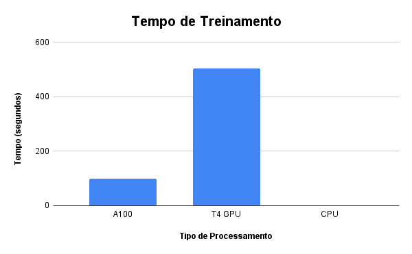

Figura 12: Gráfico de tempo de treinamento em segundos para cada processamento
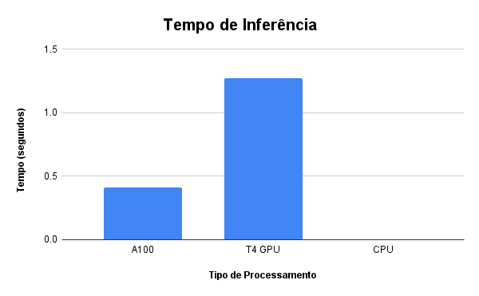

Figura 13: Gráfico de tempo de inferêcia em segundos para cada processamento
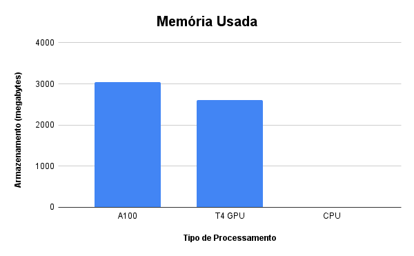

Figura 14: Gráfico de uso de memória em mb para cada processamento

Os resultados obtidos (Tabela 4 e gráficos) mostram que o modelo implementado possui em termos de tempo de inferência, uma média de 0.42 segundos para a GPU A100 e 1.27 segundos para a GPU T4. A memória utilizada foi de 3037.42 mb para a GPU A100 e 3037.42 mb para a GPU T4. O tempo de treinamento foi de 99.63 segundos para a GPU A100 e 504.2 segundos para a GPU T4. Não foi possível realizar o treinamento na CPU devido à limitação de recursos computacionais.

A figura 15 representa o gráfico de acurácia e perda ao longo das épocas de treinamento do modelo própro. A acurácia do modelo para treino e validação cresceu constantemente ao decorrer das épocas, chegando ao final na útima época a uma acurácia de aproximadamente 88% para a validação.

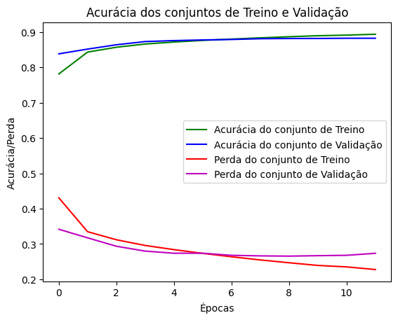

Figura 15: Gráfico de acurácia/perda ao longo das épocas de treinamento

Ao realizar inferência (figura 16) chegamos aos seguintes valores: Acurácia de 87.63%, IoU de 80% e um CoVR de 34.41% (Tabela 5).

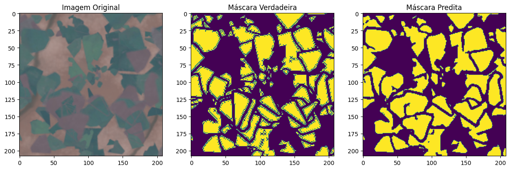

Figura 16: Resultado do modelo sem a predição de bordas

Tabela 5: Métricas da infêrencia do modelo sem bordas
|Métrica|Valor|
|-----|------|
|Acurácia|87.63%|
|IoU|80%|
|CoVR|34.41%|

### Resultado com Predição de bordas

Ao realizar teste com a predição de bordas (figura 17) chegamos aos seguintes valores: Acurácia de 85.88\%, IoU de 78\% e um CoVR de 46.638\% (Tabela 6).

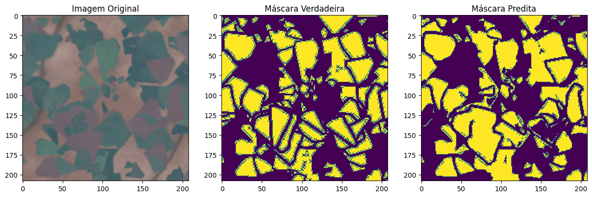

Figura 17: Resultado do modelo com a predição de bordas

Tabela 6: Métricas da infêrencia do modelo com bordas
|Métrica|Valor|
|-----|------|
|Acurácia|85.88%|
|IoU|78%|
|CoVR|46.638%|

## Resultados do treinamento da rede pré-treinada (Transfer Learning)

O treino só pode ser treinado utilizando a A100 GPU, devido ao alto uso de memória RAM e este processo levou 4 minutos. A inferência do modelo para uma imagem leva 2 segundos. A figura 18 mostra a acurácia e a perda ao longo das épocas para os conjuntos de treino e validação. A acurácia do treino ultrapassou levemente 90% e a de validação chegou em cerca de 88%.

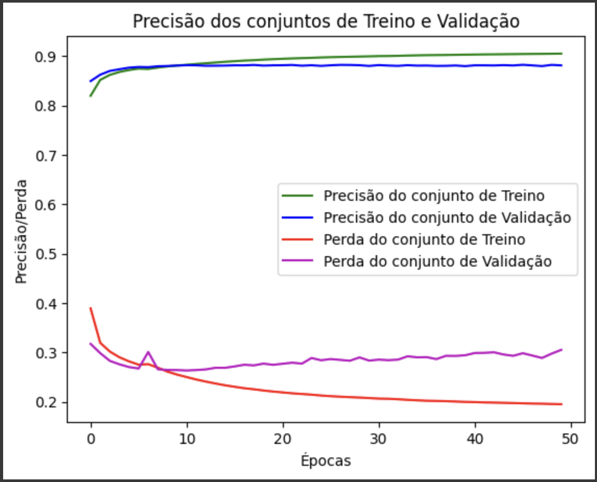

Figura 18: Gráfico de Acurácia/Perda por época no treinamento da rede pré-treinada

A figura 19 mostra o resultado de uma infêrencia deste modelo que obteve, de acordo com a tabela 7, 87.6% de acurácia, 80.4% de IoU e 36.4% de CoVR.

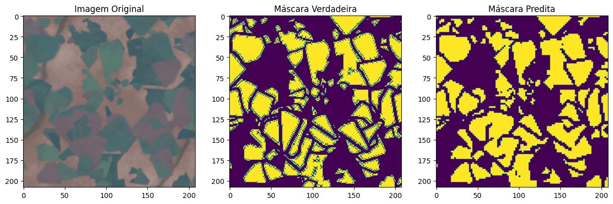

Figura 19: Resultado de inferência do modelo pré-treinado

Tabela 7: Métricas da infêrencia do modelo pré-treinado

|Métrica|Valor|
|-----|------|
|Acurácia|87.6%|
|IoU|80.4%|
|CoVR|36.4%|

# Análise e Discussão

## Comparação entre CNN própria com e sem bordas e com modelo pré-treinado com transfer learning

È possível perceber uma diferença de comportamento da acurácia e da perda nos treinamentos da CNN própria e pré-treinada. O modelo próprio mostrou uma curva de acurácia e perda que teve uma ligeira instabilidade inicial, mas convergiu bem ao longo das épocas. O uso de "early stopping" foi eficaz para parar o treinamento no momento em que a perda do conjunto de validação não melhorou mais. Assim que a perda começou a ficar maior do que a perda do conjunto de treinamento o modelo parou. 

O modelo pré-treinado com transfer learning não utilizou "early stopping" e, como resultado, os gráficos mostram uma maior variabilidade na perda de validação. Isso sugere que o modelo teve momentos de overfitting, onde a perda de validação aumentou enquanto a perda de treinamento continuava a diminuir. A falta de "early stopping" permitiu que o modelo continuasse a treinar mesmo quando a melhora da acurácia de validação não era consistente, o que pode ser menos eficiente em termos de generalização.

No entanto, os resultados foram bem parecidos, mesmo que um tenha parado com 10 épocas e outro completou as 50. Isso mostra como é importante considerar o trade-off entre parar ou continuar o treinamento. O modelo pode tanto precisar de mais épocas para aprender, mas épocas demais pode fazê-lo ter pouca generalização. Por isso, é importante levar esse ponto em consideração no momento de desenvolver uma rede convolucional.

Apesar de visualmente os três modelos parecerem semelhantes, e até possuirem métricas próximas, seus valores trazem pontos importantes. A CNN própria sem a predição de bordas apresentou uma acurácia de 87,63\%, um IoU de 80\% e um Coverage Ratio (CoVR) de 34,41\%. Esses resultados indicam que, apesar de o modelo ser eficaz em identificar corretamente a maioria das áreas de talhões, ele apresenta dificuldades em delimitar com precisão as bordas dos talhões. Esse comportamento pode ser atribuído à falta de um mecanismo específico para detectar e refinar os contornos, resultando em uma segmentação mais grosseira e menos detalhada.

O tempo de treinamento de 99,63 segundos e a inferência de 0,42 segundos na GPU A100 mostram que o modelo é eficiente em termos de processamento, o que é positivo para aplicações práticas que necessitam de respostas rápidas. No entanto, a utilização de 3037,42 MB de memória indica uma carga considerável, embora ainda manejável para a maioria das aplicações com recursos de GPU modernos.

Adicionar a predição de bordas ao modelo melhorou significativamente o CoVR para 46,638\%, embora a acurácia tenha diminuído ligeiramente para 85,88\% e o IoU para 78\%. Este aumento no CoVR sugere que a predição de bordas ajudou o modelo a delinear melhor os limites dos talhões, um aspecto crucial para a aplicação precisa na agricultura. Essa melhoria é fundamental para separar talhões adjacentes que podem ter características visuais semelhantes, garantindo uma segmentação mais clara e utilizável.

Apesar da ligeira queda na acurácia e IoU, a melhoria no CoVR pode justificar o uso dessa técnica para aplicações onde a precisão das bordas é mais importante que a acurácia geral. Isso demonstra um trade-off entre a acurácia global e a precisão dos contornos, o que deve ser considerado dependendo dos requisitos específicos da aplicação.

O modelo pré-treinado com transfer learning alcançou uma acurácia de 87,6\%, um IoU de 80,4\% e um CoVR de 36,4\%. Esses resultados são comparáveis ao modelo próprio sem predição de bordas, mas a acurácia ligeiramente menor e o CoVR intermediário indicam que, embora o transfer learning forneça uma boa base inicial, ele pode não ser otimizado para a segmentação precisa de bordas sem ajustes adicionais. Além disso, ambos os modelos apresentaram número de parâmetros treináveis próximos, 10

O tempo de treinamento mais longo de 4 minutos e o uso significativamente maior de memória (16,5 GB) destacam as necessidades computacionais elevadas desse modelo. Isso limita sua aplicação em ambientes com recursos de hardware restritos. No entanto, a utilização de transfer learning ainda proporciona uma vantagem significativa em termos de tempo de desenvolvimento, aproveitando modelos preexistentes treinados em grandes conjuntos de dados.

Os modelos próprios, tanto com quanto sem predição de bordas, demonstram que a implementação de técnicas específicas pode direcionar o modelo para melhorar aspectos particulares do problema, como a segmentação precisa de bordas. A abordagem com predição de bordas é especialmente relevante em cenários onde a precisão das demarcações é crítica para a tomada de decisões, como na gestão de talhões agrícolas. A eficiência do tempo de processamento e a carga de memória relativamente manejável tornam esses modelos adequados para aplicações em tempo real e ambientes operacionais com GPUs de alto desempenho. No entanto, a ligeira queda na acurácia ao adicionar a predição de bordas sugere a necessidade de um balanceamento cuidadoso entre a complexidade do modelo e a precisão das previsões.

O uso de modelos pré-treinados facilita a rápida implementação e potencialmente melhores resultados iniciais devido ao conhecimento adquirido em tarefas semelhantes. No entanto, o alto uso de memória e o tempo de processamento prolongado são desvantagens significativas. Para maximizar a utilidade desses modelos, é crucial contar com infraestrutura de hardware robusta. Ele também implica em uma adaptação contínua dos modelos para o contexto específico das imagens de satélite agrícolas, ajustando hiperparâmetros e incorporando dados adicionais para melhorar a segmentação de bordas.

## Comparação dos Resultados com Modelos Presentes na Literatura

Em estudo na literatura (RESING, 2021) foi demonstrado que diferentes configurações de redes e hiperparâmetros produzem variações significativas na precisão. O estudo explorou profundamente a otimização de hiperparâmetros e a avaliação da precisão das redes. Dentre os principais resultados, com 600 épocas de treinamento a rede FCN-DK5 analisada alcançou uma precisão geral de 86% com um F1-score de 49%, enquanto a rede FCN-DK6 alcançou 90% de precisão geral e 50% no F1-score. A rede U-Net3 obteve 88% de precisão geral e um F1-score de aproximadamente 58%.

Os resultados apontam que todas as redes conseguiram prever as bordas de talhões com alta precisão. A comparação entre as redes mostrou que, apesar de semelhanças nos resultados, a U-Net3 provou ser a mais precisa com menor esforço de treinamento, por apresentar um F1-score maior, sugerindo sua adequação para a delimitação de limites de campo.

### Arquiteturas FCN e UNET

Como explicitado no artigo da universidade de Twente, as Fully Convolutional Networks (FCNs) são uma escolha primordial para tarefas de segmentação semântica devido à sua capacidade de atribuir classes a cada pixel da imagem, resultando em uma delimitação precisa das bordas dos talhões. Além disso, elas operam diretamente nas imagens, permitindo a extração direta de informações relevantes dos pixels, como cores e texturas, aspectos essenciais para a análise de imagens de satélite. Uma vantagem adicional das FCNs é a flexibilidade na escolha de hiperparâmetros, o que possibilita ajustar o número de camadas e outros parâmetros para otimizar tanto a precisão quanto o desempenho da rede.

Por outro lado, a U-Net destaca-se pela sua capacidade de extrair um amplo espectro de características dos dados, o que é crucial para diferenciar talhões de outras áreas, como florestas e estradas. Ademais, adaptações específicas do U-Net foram desenvolvidas para processar imagens de satélite, otimizando a rede para essa aplicação específica. Além disso, a implementação do U-Net é facilitada pela existência de pacotes Keras, simplificando significativamente tanto a implementação quanto a adaptação da rede para a tarefa de identificação de talhões.

Em termos de vantagens, as FCNs se destacam por sua precisão e flexibilidade, enquanto a U-Net oferece a vantagem de uma extração de características mais rica, adaptações específicas para imagens de satélite e uma implementação simplificada. No entanto, ambas as arquiteturas podem enfrentar desafios computacionais, sendo as FCNs potencialmente mais complexas e a U-Net possivelmente mais pesada em termos de carga computacional.

Este estudo conclui que, enquanto a U-Net3 é mais adequada para delimitação de campos agrícolas, uma Rede Total Convolucional (FCN) pode oferecer uma boa alternativa se for possível realizar um treinamento com um número maior de épocas, apontando também a necessidade de pesquisas adicionais para otimizar ainda mais essas redes.

As conclusões existentes na literatura são consistentes com as observações que obtivemos com a rede neural construída no presente trabalho. Treinamos uma rede própria também baseada em uma arquitetura U-net e obtivemos resultados satisfatórios, com boa precisão na delimitação de talhões agrícolas. A rede foi capaz de identificar algumas bordas dos talhões mesmo com uma execução em 50 épocas, com uma acurácia em torno de 88\% no conjunto de treino e cerca de 87\% no conjunto de validação. Esses resultados corroboram a eficácia de uma rede com arquitetura U-net na segmentação de imagens de satélite, sem a necessidade de um tempo de treinamento relativamente longo.

# Conclusão
O presente trabalho teve como objetivo desenvolver e avaliar a eficácia de uma rede neural convolucional aplicada à segmentação de talhões na Região Sul do Brasil, utilizando técnicas de visão computacional. Foram implementados três modelos com abordagens diferentes. Uma CNN própria utilizando a arquitetura U-Net, a mesma CNN, mas com as bordas realçadas por um outro modelo e uma CNN pré-treinada utilizando transfer-learning. Os modelos próprios mostraram-se eficientes em termos de tempo e uso de memória, especialmente quando a predição de bordas foi incorporada, melhorando significativamente a precisão das demarcações. Já os modelos pré-treinados ofereceram uma vantagem inicial em termos de precisão geral, mas requerem recursos computacionais consideráveis. O objetivo foi parcialmente obtido, já que apesar dos resultados terem se mostrado satisfatórios, ainda há espaço para melhorar principalmente a delimitação das bordas e torná-lo mais generalizável. 

Apesar dos resultados promissores, este trabalho apresenta algumas limitações que devem ser consideradas. Primeiramente, o treinamento e análise foi feito apenas com imagens sintéticas. Assim, não há conclusões em relação ao desempenho com imagens reais. Outro ponto a ser destacado é a complexidade computacional envolvida, que restringe a aplicação prática em ambientes com recursos limitados. Para trabalhos futuros, sugere-se a expansão do conjunto de dados com mais imagens reais e rotuladas para melhorar a generalização do modelo. Ademais, a investigação de outras arquiteturas de redes neurais e técnicas de otimização e pré-processamento pode contribuir para aumentar ainda mais a precisão e eficiência dos modelos. Também é recomendável explorar a integração de dados multiespectrais e temporais para enriquecer a análise e a segmentação dos talhões.

Em suma, este estudo contribui para o avanço da aplicação de visão computacional na agricultura, fornecendo uma base sólida para futuras pesquisas e desenvolvimentos no campo da segmentação de talhões. A continuidade e ampliação deste trabalho poderão oferecer ferramentas cada vez mais precisas e acessíveis para os produtores agrícolas, auxiliando na tomada de decisões e na gestão eficiente das áreas produtivas.

# Referências

ALZUBAIDI, Laith et al. Review of deep learning: concepts, CNN architectures, challenges, applications, future directions. **Journal of big Data**, v. 8, p. 1-74, 2021.

BHATT, Dulari et al. CNN variants for computer vision: History, architecture, application, challenges and future scope. **Electronics**, v. 10, n. 20, p. 2470, 2021.

DHANYA, V. G. et al. Deep learning based computer vision approaches for smart agricultural applications. **Artificial Intelligence in Agriculture**, v. 6, p. 211-229, 2022.

DIAKOGIANNIS, Foivos I., et al. **ResUNet-a: A deep learning framework for semantic segmentation of remotely sensed data.** ISPRS Journal of Photogrammetry and Remote Sensing 162 (2020): 94-114.

DONG, Chuan-Zhi; CATBAS, F. Necati. A review of computer vision–based structural health monitoring at local and global levels. **Structural Health Monitoring**, v. 20, n. 2, p. 692-743, 2021.

HATZISAVVAS, D., & Reggia, J. A. (1997). **Using knowledge in neural networks**. Artificial Intelligence, 113(1-2), 213-237.

KRIZHEVSKY, A., Sutskever, I., & Hinton, G. E. (2012). **ImageNet classification with deep convolutional neural networks. In Advances in neural information processing systems** (pp. 1097-1105).

LUO, Zifei et al. Semantic segmentation of agricultural images: A survey. **Information Processing in Agriculture**, 2023.

LYNN, N. D.; SOURAV, A. I.; SANTOSO, A. J. Implementation of real-time edge detection using Canny and Sobel algorithms. In: **IOP Conference Series: Materials Science and Engineering**. IOP Publishing, 2021. p. 012079.

MAHARANA, Kiran; MONDAL, Surajit; NEMADE, Bhushankumar. A review: Data pre-processing and data augmentation techniques. **Global Transitions Proceedings**, v. 3, n. 1, p. 91-99, 2022.

PANERU, Suman; JEELANI, Idris. Computer vision applications in construction: Current state, opportunities & challenges. **Automation in Construction**, v. 132, p. 103940, 2021.

PEREZ L., J. Wang et al. (2017). **The Effectiveness of Data Augmentation in Image Classification using Deep Learning. In Advances in neural information processing systems**.

RONNEBERGER, O.; FISCHER, P.; BROX, T. U-Net: Convolutional Networks for Biomedical Image Segmentation. In International Conference on Medical image computing and computer-assisted intervention, Springer, Cham, 2015.

RUKHOVICH, D. I.; Koroleva, P. V.; Rukhovich, D. D.; Kalinina N. V. The Use of Deep Machine Learning for the Automated Selection of Remote Sensing Data for the Determination of Areas of Arable Land Degradation Processes Distribution **Monitoring Soil Degradation by Remote Sensing** (2021).

RESING M. et al, 2021: Automatic Delineation of Agricultural Fields from Sentinel-2 Images. Disponível em: https://github.com/resingm/field-boundary-delineation/blob/master/paper.pdf.

WANG, Mo et al. Agricultural field boundary delineation with satellite image segmentation for high-resolution crop mapping: A case study of rice paddy. **Agronomy**, v. 12, n. 10, p. 2342, 2022.

WILLIAM, P. et al. Crime analysis using computer vision approach with machine learning. In: **Mobile Radio Communications and 5G Networks: Proceedings of Third MRCN 2022**. Singapore: Springer Nature Singapore, 2023. p. 297-315.

ZHANG, Jing et al. 3D reconstruction for motion blurred images using deep learning-based intelligent systems. **Computers, Materials & Continua**, v. 66, n. 2, p. 2087-2104, 2021.


